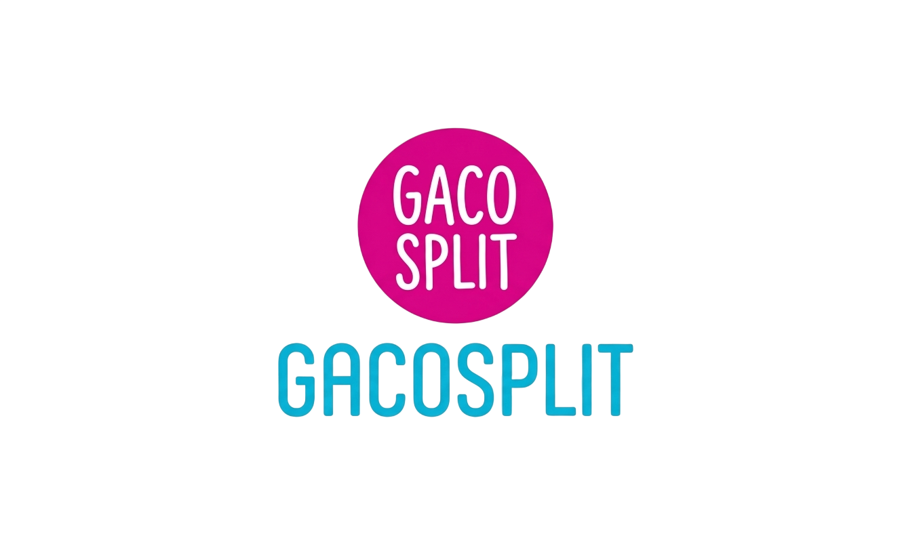

<p align="center">
  
</p>

<br/>

<p align="center">
  
</p>

<br/>

<p align="center">
  
  
  
  
  
  
</p>

<br/>

<p align="center">
  
</p>
<p align="center">
  <strong>Split bill Gacoan — gak pusing lagi urusan bayar-bayaran!</strong><br/>
  Aplikasi web untuk menghitung pembagian tagihan makan bareng secara otomatis. Khusus dirancang buat menu Mie Gacoan.
</p>

<p align="center">
  <a href="#-project-overview">Overview</a> •
  <a href="#-fitur">Fitur</a> •
  <a href="#-menu-gacoan">Menu</a> •
  <a href="#-arsitektur">Arsitektur</a> •
  <a href="#-branding--visual-identity">Branding</a> •
  <a href="#-memulai">Memulai</a> •
  <a href="#-teams">Teams</a>
</p>

---

## 📋 Project Overview

GacoSplit lahir dari masalah klasik: abis makan bareng, pada sibuk ngitung pake kalkulator HP, ujung-ujungnya ada yang ngerasa dibayarin kurang atau kebanyakan. Aplikasi ini nyelesain itu semua — tinggal masukin pesanan, beres.

### Cara Kerja

| Tahap | Kegiatan                                                            |
| ----- | ------------------------------------------------------------------- |
| **1** | Buat sesi dan masukin nama temen-temen yang ikut makan              |
| **2** | Pilih menu Gacoan — ada yang pesen sendiri, ada yang dimakan bareng |
| **3** | Sistem otomatis hitung total per orang + PPN 11%                    |
| **4** | Tinggal salin hasilnya dan kirim ke grup WhatsApp                   |

### Fitur Utama

| Fitur                 | Deskripsi                                  |
| --------------------- | ------------------------------------------ |
| **👥 Kelola Peserta** | Tambah & hapus peserta (2–10 orang)        |
| **🍝 Input Personal** | Masing-masing pesen menu sendiri-sendiri   |
| **🤝 Menu Bersama**   | Item bareng dibagi rata ke semua peserta   |
| **🧮 Auto Calculate** | Total per orang + PPN langsung muncul      |
| **📋 Salin Hasil**    | Copy rincian tagihan ke clipboard          |
| **🔄 Reset Sesi**     | Mulai dari awal tanpa reload halaman       |
| **💸 PPN 11%**        | Pajak dihitung otomatis dari DPP per orang |

---

## 🧮 Logika Perhitungan

```
DPP = TotalPersonal + (TotalShared / JumlahPeserta)
PPN = DPP × 11% (dibulatkan ke rupiah penuh)
TotalTagihan = DPP + PPN
```

Setiap orang liat rinciannya: total pesanan sendiri + bagian menu bareng + PPN 11%. Hasil akhir tinggal di-copy ke WhatsApp.

---

## 🥟 Menu Gacoan

> Data menu bersumber dari [Tokopedia Blog](https://www.tokopedia.com/blog/menu-mie-gacoan-tvl/).

| Menu                   | Kategori | Harga     |
| ---------------------- | -------- | --------- |
| Mie Gacoan             | Mie      | Rp 10.000 |
| Mie Gacoan lvl 6 – 8   | Mie      | Rp 10.900 |
| Mie Hompimpa           | Mie      | Rp 10.000 |
| Mie Hompimpa lvl 6 – 8 | Mie      | Rp 10.900 |
| Mie Suit               | Mie      | Rp 10.000 |
| Udang Keju             | Cemilan  | Rp 9.100  |
| Udang Rambutan         | Cemilan  | Rp 9.100  |
| Lumpia Udang           | Cemilan  | Rp 9.100  |
| Siomay                 | Cemilan  | Rp 9.100  |
| Pangsit Goreng         | Cemilan  | Rp 10.000 |
| Es Gobak Sodor         | Es       | Rp 9.100  |
| Es Teklek              | Es       | Rp 5.900  |
| Es Sluku Bathok        | Es       | Rp 5.900  |
| Es Petak Umpet         | Es       | Rp 9.100  |
| Air Mineral            | Minuman  | Rp 4.100  |
| Lemon Tea              | Minuman  | Rp 5.900  |
| Milo                   | Minuman  | Rp 8.200  |
| Orange                 | Minuman  | Rp 5.000  |
| Es Teh                 | Minuman  | Rp 4.100  |
| Tea Tarik              | Minuman  | Rp 6.400  |
| Vanila Latte           | Minuman  | Rp 8.200  |
| Thai Tea               | Minuman  | Rp 8.200  |
| Thai Green Tea         | Minuman  | Rp 8.200  |
| Es Coklat              | Minuman  | Rp 8.200  |

---

## 🏗️ Arsitektur

Aplikasi ini **monolitik** — backend dan frontend jalan dalam satu server Spring Boot. User buka halaman di browser, JavaScript ngomong sama API backend, backend ngurus data dan perhitungan.

### Tech Stack

| Layer        | Teknologi                                   |
| ------------ | ------------------------------------------- |
| **Backend**  | Java 17+, Spring Boot 4.0.6, Maven          |
| **Frontend** | Thymeleaf, Vanilla JS, TailwindCSS v3 (CDN) |
| **Database** | H2 (file-based: `~/test`)                   |
| **ORM**      | Spring Data JPA + Hibernate 7               |

### 📂 Struktur Proyek

| Lokasi                            | Konten                                                                 |
| --------------------------------- | ---------------------------------------------------------------------- |
| `src/main/java/.../gacosplit/`    | Kode backend — controller, service, model, repository                  |
| `src/main/resources/templates/`   | Halaman Thymeleaf (HTML)                                               |
| `src/main/resources/static/`      | Aset frontend statis — CSS, JavaScript                                 |
| `src/main/resources/static/js/`   | `app.js`, `api.js`, `github.js` — logika frontend                      |
| `src/main/resources/static/css/`  | `styles.css` — kustom styling                                          |
| `public/`                         | Aset branding & visual — Banner, Logo, UI preview screenshot           |
| `docs/`                           | Dokumentasi lengkap — lihat tabel di bawah                             |

### 🔑 Function Penting

| Function                           | Lokasi                   | Penjelasan                                                         |
| ---------------------------------- | ------------------------ | ------------------------------------------------------------------ |
| `hitungTagihan()`                  | `app.js`                 | Otak perhitungan di frontend — ngitung total + PPN tiap orang      |
| `renderSummary()`                  | `app.js`                 | Nampilin hasil perhitungan ke layar biar user bisa liat            |
| `formatHasil()`                    | `app.js`                 | Ubah hasil jadi teks rapi buat di-copy ke WhatsApp                 |
| `calculate()`                      | `SessionController.java` | Endpoint API yang panggil `CalculationService` buat hitung tagihan |
| `findBySessionIdAndIsSharedTrue()` | `ItemRepository.java`    | Query otomatis buat ambil semua item bersama dalam satu session    |

---

## 🎨 Branding & Visual Identity

Proyek ini menggunakan `LOGO.png` sebagai identitas merek utama. Aset ini menjadi pusat dari seluruh tampilan visual GacoSplit, mulai dari README hingga browser tab pengguna.

### Penggunaan Logo

| Tujuan              | Keterangan                                                    |
| ------------------- | ------------------------------------------------------------- |
| **Favicon**         | Ikon tab browser — muncul di bookmark, tab, dan riwayat       |
| **UI Identity**     | Ditampilkan di antarmuka aplikasi sebagai identitas merek     |
| **README Branding** | Representasi visual utama di halaman proyek                   |

### Integrasi HTML Head

Tambahkan cuplikan berikut di `<head>` halaman HTML aplikasi untuk menetapkan `LOGO.png` sebagai favicon dan identitas merek:

```html
<link rel="icon" type="image/png" href="/public/LOGO.png" />
```

Logo ini berfungsi sebagai elemen identitas tunggal (single source of truth for branding) yang digunakan secara konsisten di seluruh touchpoint pengguna, baik di dalam aplikasi maupun di luar (browser tab, bookmark, social share preview).

---

## 🛠️ Memulai

### Prasyarat

- **Java 17+** — [Download JDK](https://adoptium.net/)
- **Maven** (opsional — pakai `mvnw.cmd` bawaan project)

### Instalasi

```bash
git clone https://github.com/fjrfthrrhmn/GacoSplit.git
cd GacoSplit
./mvnw.cmd spring-boot:run
```

Buka `http://localhost:8080` di browser dan klik **Mulai Hitung!**.

> Frontend pake TailwindCSS via CDN — gak perlu `npm install` atau build CSS.

---

## 👥 Teams

| Name               | Role               | GitHub                                         | Instagram                                                  |
| ------------------ | ------------------ | ---------------------------------------------- | ---------------------------------------------------------- |
| BENEDICTUS MIKAEL  | Data Model         | -                                              | [@beben_lionel](https://www.instagram.com/beben_lionel/)   |
| FAJAR FATHURRAHMAN | Frontend Developer | [@fjrfthrrhmn](https://github.com/fjrfthrrhmn) | [@fjrfthrrhmn](https://instagram.com/fjrfthrrhmn)          |
| ISAD FIRDAUS       | UI/UX              | -                                              | [@isadfirdaus29](https://www.instagram.com/isadfirdaus29/) |
| SHAMAS KHALIS      | Frontend Developer | [@shmmas](https://github.com/shmmas)           | [@shmmass\_](https://www.instagram.com/shmmass_/)          |

---

## 📚 Dokumentasi

| Dokumen                                        | Deskripsi                                                 |
| ---------------------------------------------- | --------------------------------------------------------- |
| [`DESIGN.md`](DESIGN.md)                       | SSOT — Apple-inspired design system (warna, font, layout) |
| [`AGENTS.md`](AGENTS.md)                       | Role definitions untuk AI agents dan tim pengembangan     |
| [`CHANGELOG.md`](CHANGELOG.md)                 | Riwayat rilis dan catatan perubahan tiap versi            |
| [`docs/PRODUCT.md`](docs/PRODUCT.md)           | Gambaran produk, problem yang dipecahkan, dan solusi      |
| [`docs/FEATURES.md`](docs/FEATURES.md)         | Prioritas MoSCoW, acceptance criteria, roadmap fitur      |
| [`docs/ARCHITECTURE.md`](docs/ARCHITECTURE.md) | Data model, endpoint API, dan arsitektur sistem           |
| [`docs/ROADMAP.md`](docs/ROADMAP.md)           | Milestone pengembangan dan rencana ke depan               |
| [`docs/UI-UX.md`](docs/UI-UX.md)               | Token desain: palet warna, tipografi, shadow, spacing     |
| [`docs/UX-FLOW.md`](docs/UX-FLOW.md)           | Alur pengguna dari awal buka aplikasi sampai hasil        |
| [`docs/UX-WRITING.md`](docs/UX-WRITING.md)     | Panduan copywriting dan tone of voice aplikasi            |

---

## ⚠️ Keterbatasan & Rencana

| Keterbatasan Saat Ini                             | Rencana ke Depan                      |
| ------------------------------------------------- | ------------------------------------- |
| Item bersama dibagi rata (belum ada rasio kustom) | Berbagi sesi via tautan / QR code     |
| Belum ada autentikasi / akun pengguna             | Riwayat transaksi antar sesi          |
| Data disimpan di H2 lokal                         | Input struk via OCR                   |
| Lingkup MVP — satu sesi sekali pakai              | Progressive Web App (PWA) & Dark mode |

---

<p align="center">
  Dibikin dengan ❤️ — biar gak ada lagi drama split bill di circle pertemanan 😭
</p>
