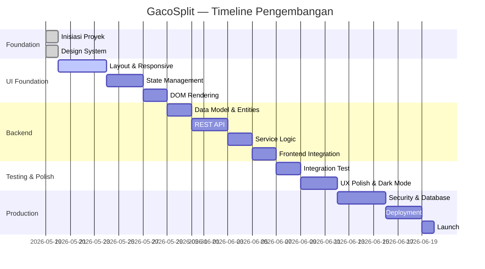

# GacoSplit — Roadmap Pengembangan

> **Penyusunan menggunakan skill:** `writing-plans`  
> **Pendekatan:** Prioritas utama pengembangan antarmuka (UI) sebelum fungsionalitas backend/logic.

**Tujuan:** Membangun GacoSplit dari tahap inisiasi hingga deployment dengan urutan yang memprioritaskan pengalaman pengguna visual dan interaktif terlebih dahulu.

**Arsitektur:** Monolitik Spring Boot dengan frontend statis (HTML + TailwindCSS + Vanilla JS). UI dikembangkan secara independen dengan data dummy sebelum backend diintegrasikan.

---

## Fase 0: Foundation ✅ (Selesai)

| Milestone                | Status      | Deskripsi                                      |
| ------------------------ | ----------- | ---------------------------------------------- |
| Inisiasi Proyek          | ✅ Selesai  | Scaffold Spring Boot dengan Maven              |
| Setup Dokumentasi        | ✅ Selesai  | Definisi produk, README, dokumentasi modular   |
| Version Control          | ✅ Selesai  | Inisialisasi repository Git                    |
| Konfigurasi Tools        | ✅ Selesai  | Maven wrapper, .gitignore, .gitattributes      |
| Setup Design System      | ✅ Selesai  | Konfigurasi Tailwind CSS dengan palet Biru/Pink|

---

## Fase 1: UI Foundation (v0.1.0)

> Prioritas: Membangun antarmuka pengguna yang utuh sebelum logika backend.

### Task 1.1: Layout Utama (index.html)

**Files:**
- Referensi: `docs/design/ui-ux.md`

**Langkah:**

- [ ] **Buat struktur HTML dasar** dengan container responsive max-width 800px
- [ ] **Header aplikasi** — logo/text "GacoSplit" + tombol "Baru" (reset)
- [ ] **Tab navigasi orang** — daftar nama peserta dalam bentuk tab/chip
- [ ] **Form input personal** — dropdown orang, dropdown menu, quantity, tombol tambah
- [ ] **Form input shared** — dropdown menu, quantity, tombol tambah
- [ ] **Daftar pesanan personal** — per orang dengan item-itemnya
- [ ] **Daftar shared item** — item bersama dengan notasi pembagian
- [ ] **Summary section** — total per orang dan grand total
- [ ] **Tombol aksi** — Salin hasil, Mulai Baru

---

## Fase 2: Frontend Logic (v0.2.0)

> Prioritas: State management dan logika perhitungan di frontend dengan data dummy.

### Task 2.1: State Management (app.js)

**Files:**
- Create: `src/main/resources/static/js/app.js`
- Create: `src/main/resources/static/js/api.js`

**Langkah:**

- [ ] **Implementasi state management client-side** mengikuti struktur dari `docs/architecture/functionality.md`:
  ```javascript
  const state = {
    session: null,
    people: [],
    personalItems: [],
    sharedItems: [],
    activePerson: null,
    calculationResult: { grandTotal: 0, sharedTotal: 0, sharedPerPerson: 0, perPersonAmounts: [] },
    error: null,
  };
  ```
- [ ] **Fungsi CRUD state**:
  - `addPerson(name)` — tambah orang ke daftar
  - `removePerson(id)` — hapus orang dan item personal-nya, update shared
  - `addPersonalItem(personId, menuItem, quantity)` — tambah pesanan personal
  - `addSharedItem(menuItem, quantity)` — tambah item bersama
  - `removeItem(itemId)` — hapus item
- [ ] **Fungsi kalkulasi** sesuai rumus di `docs/architecture/functionality.md#f5-calculation-logic`

### Task 2.2: Data Binding & DOM Rendering

**Files:**
- Modify: `src/main/resources/static/js/app.js`
- Modify: `src/main/resources/static/index.html`

**Langkah:**

- [ ] **Fungsi render** — `renderPeople()`, `renderPersonalItems()`, `renderSharedItems()`, `renderSummary()`
- [ ] **Event binding** — wire form inputs ke state functions
- [ ] **Dropdown menu template Gacoan** — data menu dari `docs/architecture/data-model.md`
- [ ] **Error state handling** — validasi form: nama minimal 2 karakter, min 2 orang, quantity 1-99

### Task 2.3: Copy to Clipboard

**Files:**
- Modify: `src/main/resources/static/js/app.js`

**Langkah:**

- [ ] **Fungsi format hasil** — format teks sesuai template di `docs/architecture/functionality.md#f6`
- [ ] **Fungsi copy** — `navigator.clipboard.writeText()` dengan fallback
- [ ] **Feedback visual** — toast notification "Tersalin!" setelah copy

---

## Fase 3: Backend Integration (v0.3.0)

> Prioritas: REST API, database, dan integrasi frontend-backend.

### Task 3.1: Data Model & JPA Entities

**Files:**
- Create: `src/main/java/com/gacosplit/model/Session.java`
- Create: `src/main/java/com/gacosplit/model/Person.java`
- Create: `src/main/java/com/gacosplit/model/Item.java`
- Referensi: `docs/architecture/data-model.md`

**Langkah:**

- [ ] **Entity Session** — field: id (UUID), name, createdAt, totalAmount, sharedAmount
- [ ] **Entity Person** — field: id (UUID), name, personalTotal, sharedPortion, amountOwed
- [ ] **Entity Item** — field: id (UUID), name, price, quantity, isShared, orderedBy
- [ ] **JPA Repositories** — `SessionRepository`, `PersonRepository`, `ItemRepository`
- [ ] **DTO classes** — `SessionRequest`, `SessionResponse` di `model/dto/`

### Task 3.2: REST API Endpoints

**Files:**
- Create: `src/main/java/com/gacosplit/controller/SessionController.java`
- Create: `src/main/java/com/gacosplit/controller/MenuController.java`
- Referensi: `docs/architecture/technical-notes.md`

**Langkah:**

- [ ] **Endpoint sessions**: POST `/api/sessions`, GET `/api/sessions/{id}`, DELETE `/api/sessions/{id}/reset`
- [ ] **Endpoint people**: POST `/api/sessions/{id}/people`, DELETE `/api/sessions/{id}/people/{personId}`
- [ ] **Endpoint items**: POST `/api/sessions/{id}/items`, PUT `/api/sessions/{id}/items/{itemId}`, DELETE `/api/sessions/{id}/items/{itemId}`
- [ ] **Endpoint calculate**: GET `/api/sessions/{id}/calculate`
- [ ] **Endpoint menu**: GET `/api/menu`

### Task 3.3: Service Layer & Calculation Logic

**Files:**
- Create: `src/main/java/com/gacosplit/service/SessionService.java`
- Create: `src/main/java/com/gacosplit/service/CalculationService.java`

**Langkah:**

- [ ] **SessionService** — business logic CRUD session, validasi aturan bisnis
- [ ] **CalculationService** — implementasi logika split bill (personal + shared)
- [ ] **Database config** — `application.properties` dengan H2 in-memory atau SQLite

### Task 3.4: Frontend-Backend Integration

**Files:**
- Modify: `src/main/resources/static/js/api.js`
- Modify: `src/main/resources/static/js/app.js`

**Langkah:**

- [ ] **API client** — fungsi `fetchSession()`, `createSession()`, `addPerson()`, `addItem()`, `calculate()`, `resetSession()`
- [ ] **Error handling** — toast untuk HTTP errors, retry option
- [ ] **Loading states** — skeleton/spinner selama API call berlangsung

---

## Fase 4: Integration Testing & Polish (v0.4.0)

### Task 4.1: Integration Test

**Files:**
- Create: `src/test/java/com/gacosplit/GacosplitApplicationTests.java`

**Langkah:**

- [ ] **Test end-to-end flow**: buat session → tambah 3 orang → tambah personal items → tambah shared item → calculate → verifikasi hasil
- [ ] **Test validasi**: min 2 orang, max 10 orang, duplicate nama, empty name
- [ ] **Test edge cases**: hapus orang di tengah session, shared item tanpa orang

### Task 4.2: UX Polish

**Files:**
- Modify: `src/main/resources/static/index.html`
- Modify: `src/main/resources/static/css/tailwind.css`

**Langkah:**

- [ ] **Animasi transisi** — fade-in untuk card, slide-in untuk daftar item
- [ ] **Empty states** — ilustrasi/teks ketika belum ada data
- [ ] **Dark mode toggle** — `@custom-variant dark` dengan preferensi lokal

---

## Fase 5: Production Readiness (v1.0.0)

| Milestone             | Deskripsi                                               |
| --------------------- | ------------------------------------------------------- |
| Security Audit        | Sanitasi input, konfigurasi CORS, rate limiting         |
| Production Database   | Migrasi ke PostgreSQL/MySQL                             |
| Deployment Pipeline   | CI/CD dengan GitHub Actions, Docker build               |
| Documentation Final   | API docs, panduan deployment, panduan pengguna           |
| Performance Testing   | Pastikan stabil dengan 100+ sesi concurrent             |

---

## Target Timeline


